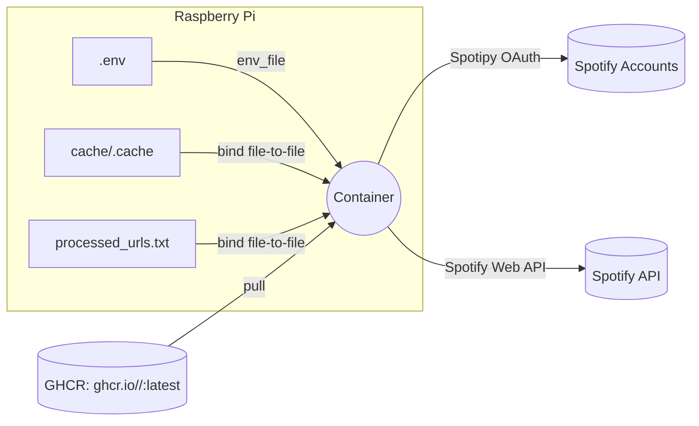
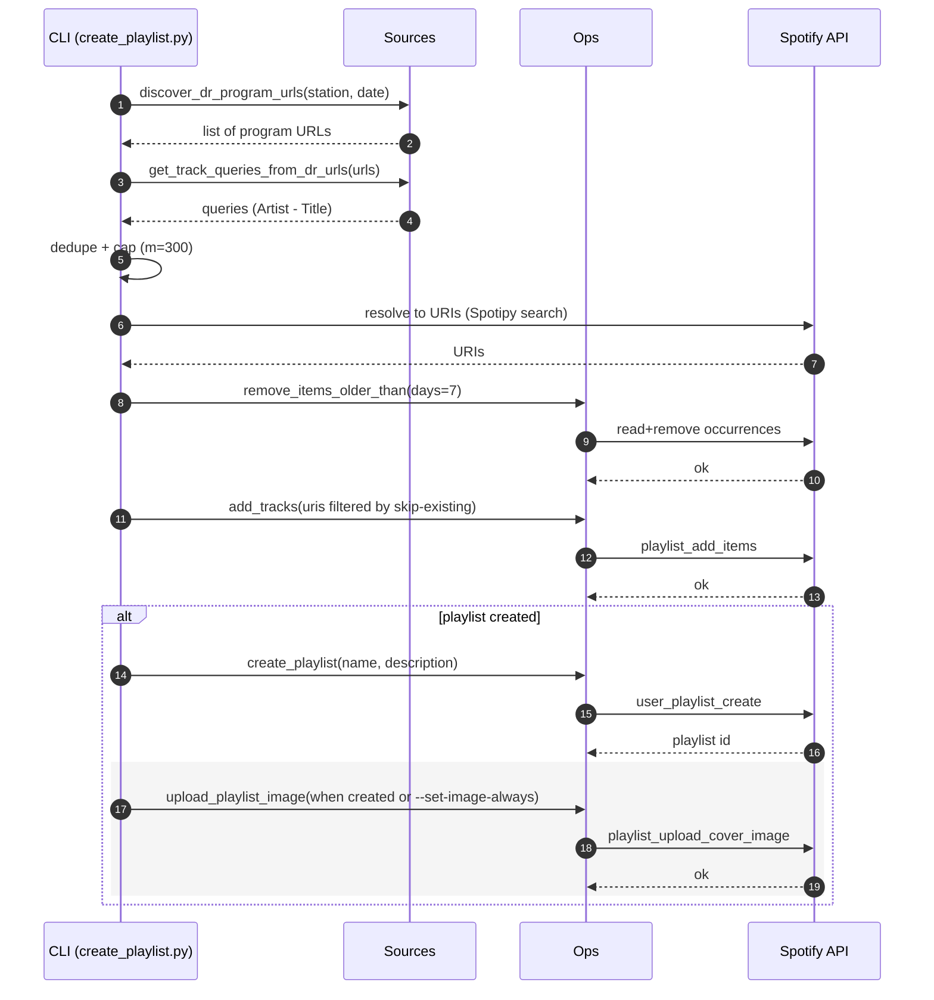
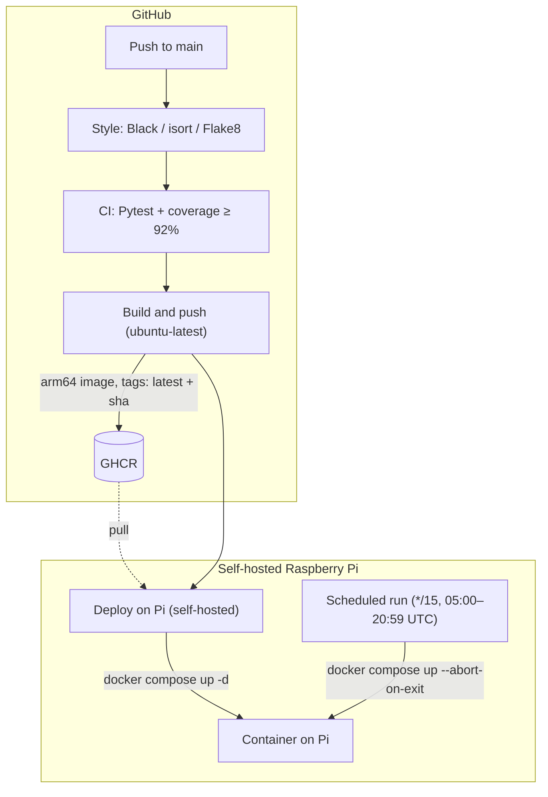

# Architecture Overview

This document describes the current architecture of the Spotify Playlist App: components, runtime topology, data flow, configuration, containerization, and CI/CD automation. It documents the solution as it exists.

## High‑Level Components

- App code (this repo)
  - `spotify_playlist/cli.py`: entrypoint orchestration (args → sources → resolve → ops)
  - `spotify_playlist/sources.py`: URL discovery + scraping (DR pages), JSON/ORB helpers
  - `spotify_playlist/ops.py`: playlist creation, add/remove items, cover upload, discovery
  - `spotify_playlist/core.py`: auth, batching, helpers, sanitize/pluck utils
- Container image (Dockerfile)
  - Base: `python:3.11-slim`
  - Installs runtime deps (spotipy, requests, bs4, lxml, python-dotenv)
  - Copies repo into `/app`
- Compose (deploy/docker-compose.yml)
  - One‑shot job that runs the CLI with a safe array command, no shell interpolation
  - Mounts token + processed URLs as file-to-file binds
  - Loads Spotify credentials from a host `.env`
- GitHub Container Registry (GHCR)
  - `ghcr.io/<owner>/<repo>:latest` (lowercase)
- GitHub Actions
  - Style/CI: lint + tests/coverage
  - Deploy: build image (GH‑hosted) → deploy on Pi (self‑hosted)
  - Schedule: run one‑shot every 15 minutes (self‑hosted)

## Runtime Topology

```
+--------------------------- Self‑Hosted Raspberry Pi ---------------------------+
|                                                                               |
|  /home/<user>/opt/spotify                                                     |
|    ├── .env                    (SPOTIFY_CLIENT_ID/SECRET/REDIRECT_URI)       |
|    ├── cache/.cache            (Spotipy OAuth token, single file)            |
|    └── processed_urls.txt      (persisted across runs)                       |
|                                                                               |
|  GitHub Actions Runner (systemd)                                             |
|    └── checks out repo to: ~/actions-runner/_work/<repo>/<repo>              |
|                                                                               |
|  docker compose up (one‑shot)                                                 |
|    image: ghcr.io/<owner>/<repo>:latest                                      |
|    entrypoint: ["python","-u"]                                               |
|    command: create_playlist.py --append-to-name "P3 (Updated live)" ...      |
|    env_file: /home/<user>/opt/spotify/.env                                   |
|    volumes:                                                                   |
|      /home/<user>/opt/spotify/cache/.cache -> /app/.cache                    |
|      /home/<user>/opt/spotify/processed_urls.txt -> /app/processed_urls.txt  |
|                                                                               |
+-------------------------------------------------------------------------------+
```

### Runtime Topology (Mermaid)



## Data Flow (One‑Shot Run)

1) Discover DR program URLs for the station/date (today, UTC) via `discover_dr_program_urls()`.
2) Fetch each URL and extract "Artist - Title" with multiple strategies (NEXT_DATA, JSON‑LD, DOM labels, JSON scripts, Regex fallback). Dedupe across pages.
3) Cap to `-m 300` if configured.
4) Resolve each item to a Spotify track URI (Spotipy), sanitizing queries.
5) Retention: remove occurrences older than `--retention-days 7` from the target playlist.
6) Skip existing: filter out URIs already present.
7) Append remaining URIs to the playlist (create on first run).
8) Cover image: upload on create; optionally refresh on existing with `--set-image-always`.

### Data Flow (Mermaid)



## Configuration (Env/Flags)

- Host `.env` (mapped via `env_file` in compose):
  - `SPOTIFY_CLIENT_ID`, `SPOTIFY_CLIENT_SECRET`, `SPOTIFY_REDIRECT_URI`
- Compose environment:
  - `PLAYLIST_DESCRIPTION_FILE=/app/playlist-description.txt` (baked into image)
  - `PYTHONUNBUFFERED=1` (stream logs)
- CLI description precedence:
  - `--description` > `PLAYLIST_DESCRIPTION` > `PLAYLIST_DESCRIPTION_FILE` > ""
- CLI flags in one‑shot:
  - `--append-to-name "P3 (Updated live)"`
  - `--from-dr-day p3 today`
  - `--processed-urls-file processed_urls.txt`
  - `--image-path DRP3_logo.jpeg`
  - `--set-image-always` (refresh cover for existing playlists)
  - `--skip-existing`
  - `--retention-days 7`
  - `-m 300` (cap)
  - `--debug-scrape` (extraction counts and URL discovery)

## Docker Image & Compose Choices

- Array form for command (no shell): avoids `$()` interpolation quirks and YAML quoting issues.
- File‑to‑file token mount: `/home/<user>/opt/spotify/cache/.cache -> /app/.cache` to match Spotipy’s default single‑file cache.
- Processed URLs persisted as host file `/home/<user>/opt/spotify/processed_urls.txt`.

## CI/CD Pipelines

### Build & Push (Deploy workflow)
- GH‑hosted job builds `linux/arm64` image and pushes tags (`latest`, `sha`) to GHCR using `GITHUB_TOKEN`.
- Ensures lowercase image: `ghcr.io/${REPO_LC}` via `${GITHUB_REPOSITORY,,}`.

### Deploy (Self‑Hosted job on Pi)
- Resolves `SPOTIFY_BASE_DIR`/`SPOTIFY_ENV_FILE` from repo variables/secrets (defaults: `/opt/spotify`, `$BASE_DIR/.env`).
- Touches token file + processed file.
- `docker compose -f deploy/docker-compose.yml pull && up -d` (to deploy image).

### Scheduled Run (Self‑Hosted)
- Cron: `*/15 5-20 * * *` (every 15 minutes between 05:00 and 20:59 UTC).
- Diagnostics:
  - Runner user, Docker versions, resolved envs, compose config
  - Optional step: create + inspect a container to print Entrypoint/Cmd
- One‑shot: `docker compose -f deploy/docker-compose.yml up --pull=always --abort-on-container-exit`
- Observability:
  - Streams logs to artifact and embeds last 200 lines in job Summary
  - Extracts final result line (Created/Updated … with N new tracks)
  - Warns when N=0; shows discovery and extraction method counts

## Authentication (OAuth)

- First run requires token file creation (`.cache` JSON).
- Options:
  - Local auth then `scp` `.cache` to `/home/<user>/opt/spotify/cache/.cache`.
  - Headless Pi: expose `-p 8888:8888` and open the printed URL via SSH tunnel (`ssh -NL 8888:localhost:8888 pi@host`).
- Security: treat `.cache` as a secret; rotate if exposed (delete file and re‑auth).

## Time & Deduplication Semantics

- “today” is container UTC; near local midnight, you may see zero results temporarily.
- Deduplication: within scraped items for the run (first‑seen wins). With `--skip-existing`, already present URIs are not added.
- Retention executes before additions: items older than N days are removed first.

## Permissions & Ownership

- Cover upload works only if you own the target playlist and the token has `ugc-image-upload` scope.
- Runner user must:
  - be in `docker` group (to run compose)
  - be able to read `.env` and token `.cache` (600 is fine if owned by the runner user)
  - have traverse perms on parent directories (e.g., `chmod 755` on `/home/<user>`, `/home/<user>/opt`, `/home/<user>/opt/spotify` if necessary)

## CI/CD (Mermaid)


