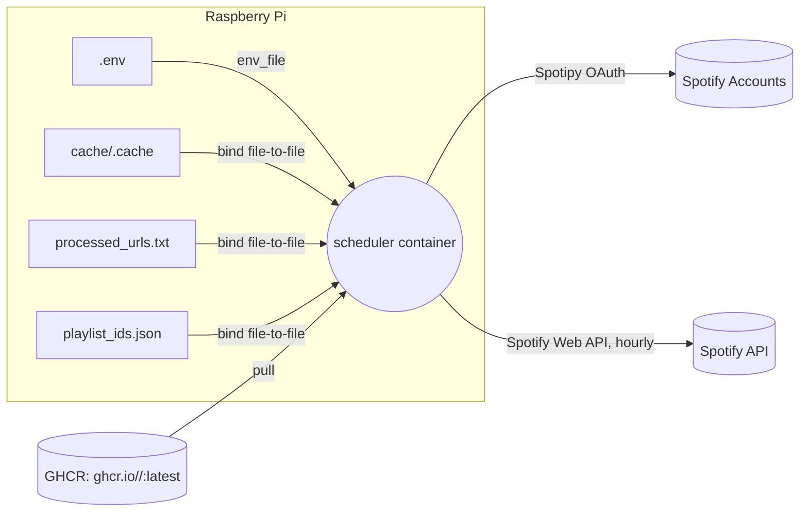
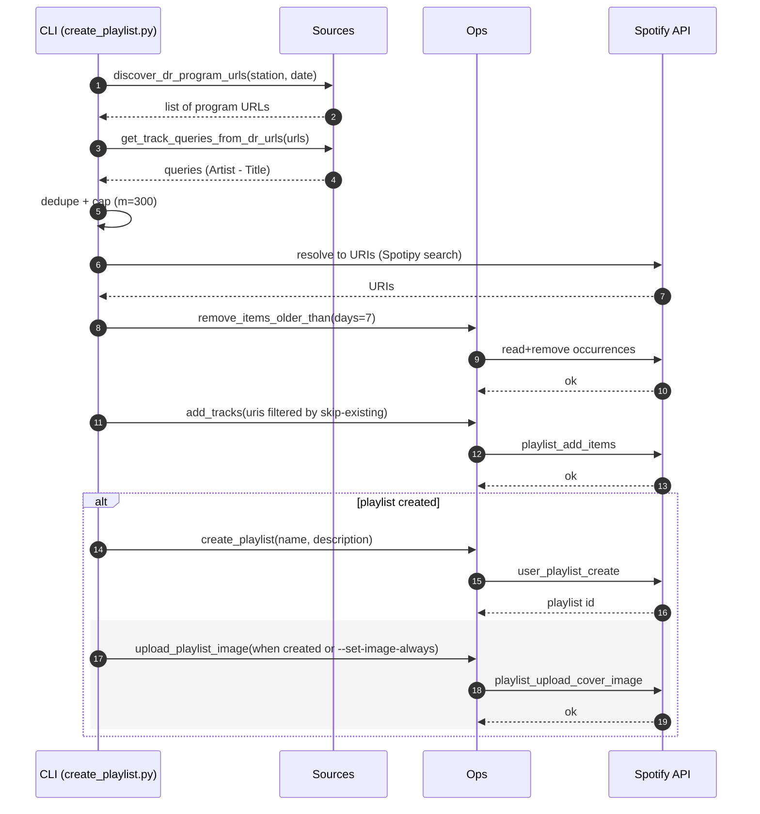
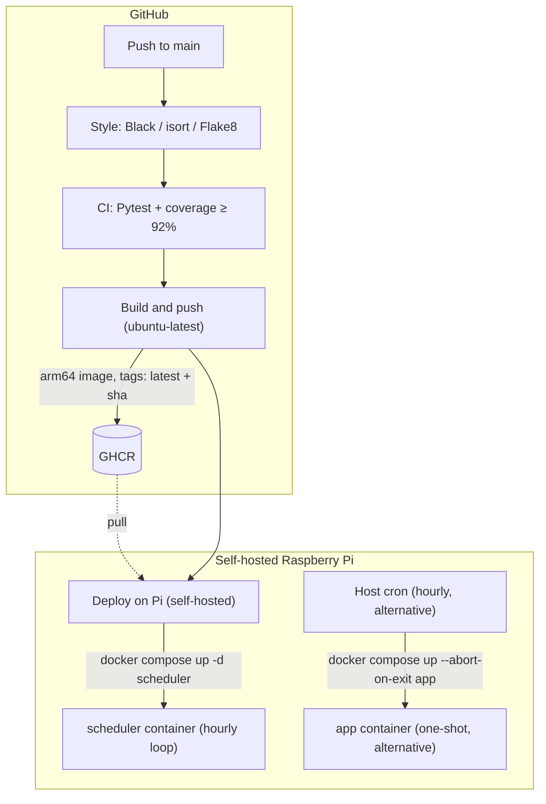

# Architecture Overview

This document describes the current architecture of the Spotify Playlist App: components, runtime topology, data flow, configuration, containerization, and CI/CD automation. It documents the solution as it exists.

## High‑Level Components

- App code (this repo)
  - `spotify_playlist/cli.py`: entrypoint orchestration (args → sources → resolve → ops)
  - `spotify_playlist/sources.py`: URL discovery + scraping (DR pages), JSON/ORB helpers
  - `spotify_playlist/ops.py`: playlist creation, add/remove items, cover upload, discovery
  - `spotify_playlist/core.py`: auth, batching, helpers, sanitize/pluck utils
- Container image (Dockerfile)
  - Base: `python:3.11-slim`
  - Installs runtime deps (spotipy, requests, bs4, lxml, python-dotenv)
  - Copies repo into `/app`
- Compose (deploy/docker-compose.yml)
  - Two mutually exclusive services, gated behind separate Compose profiles
    so a bare `docker compose up` (no profile, no explicit service) starts
    neither - both `up -d scheduler` and `up -d app`/`up ... app` name a
    service explicitly to bypass the gate for that one service only:
    - `scheduler` (`profiles: [scheduler]`): long-running container, loops
      internally and updates hourly by default (`SCHEDULE_INTERVAL_SECONDS=3600`).
      This is the recommended way to run on a Pi.
    - `app` (`profiles: [oneshot]`): one-shot job driven by host cron via
      `scripts/run_schedule.sh`, for when a long-running container isn't wanted.
  - Mounts token, processed URLs, and the playlist-ID cache as file-to-file binds
  - Loads Spotify credentials from a host `.env`
- GitHub Container Registry (GHCR)
  - `ghcr.io/<owner>/<repo>:latest` (lowercase)
- GitHub Actions
  - Style/CI: lint + tests/coverage
  - Deploy: build image (GH‑hosted) → deploy `scheduler` on Pi (self‑hosted)
- Playlist ID cache (`playlist_ids.json`)
  - Once a playlist is found or created for a given `--append-to-name`, its
    ID is persisted here. Later runs read the ID directly (verifying it's
    still accessible) instead of re-searching by name, which removes the
    main way this app used to end up creating duplicate playlists.

## Runtime Topology

```
+--------------------------- Self‑Hosted Raspberry Pi ---------------------------+
|                                                                               |
|  /opt/spotify                                                                 |
|    ├── .env                    (SPOTIFY_CLIENT_ID/SECRET/REDIRECT_URI)       |
|    ├── cache/.cache            (Spotipy OAuth token, single file)            |
|    ├── processed_urls.txt      (persisted across runs)                       |
|    └── playlist_ids.json       (name -> playlist ID, persisted across runs)  |
|                                                                               |
|  docker compose up -d scheduler   (recommended: single long-running container)|
|    image: ghcr.io/<owner>/<repo>:latest                                      |
|    entrypoint: bash /app/scripts/container_scheduler.sh                      |
|    loops internally every SCHEDULE_INTERVAL_SECONDS (default 3600 = hourly)  |
|    command each iteration: create_playlist.py --append-to-name "P3 ..." ...  |
|    env_file: /opt/spotify/.env                                               |
|    volumes:                                                                   |
|      /opt/spotify/cache/.cache -> /app/.cache                                |
|      /opt/spotify/processed_urls.txt -> /app/processed_urls.txt              |
|      /opt/spotify/playlist_ids.json -> /app/playlist_ids.json                |
|                                                                               |
|  (alternative, not run at the same time as the above)                        |
|  Host cron -> scripts/run_schedule.sh -> docker compose up ... app (one‑shot)|
|                                                                               |
+-------------------------------------------------------------------------------+
```

### Runtime Topology (Mermaid)


```mermaid
flowchart LR
  subgraph Host["Raspberry Pi"]
    A[.env] -->|env_file| C((scheduler container))
    B[cache/.cache] -->|"bind file-to-file"| C
    D[processed_urls.txt] -->|"bind file-to-file"| C
    E[playlist_ids.json] -->|"bind file-to-file"| C
  end

  C -->|Spotipy OAuth| S[(Spotify Accounts)]
  C -->|"Spotify Web API, hourly"| W[(Spotify API)]
  R[(GHCR: ghcr.io/<owner>/<repo>:latest)] -->|pull| C
```

## Data Flow (One‑Shot Run)

1) Discover DR program URLs for the station/date (today, UTC) via `discover_dr_program_urls()`.
2) Fetch each URL and extract "Artist - Title" with multiple strategies (NEXT_DATA, JSON‑LD, DOM labels, JSON scripts, Regex fallback). Dedupe across pages.
3) Cap to `-m 300` if configured.
4) Resolve each item to a Spotify track URI (Spotipy), sanitizing queries.
5) Retention: remove occurrences older than `--retention-days 7` from the target playlist.
6) Skip existing: filter out URIs already present.
7) Append remaining URIs to the playlist (create on first run).
8) Cover image: upload on create; optionally refresh on existing with `--set-image-always`.

### Data Flow (Mermaid)


```mermaid
sequenceDiagram
  autonumber
  participant CR as CLI (create_playlist.py)
  participant SRC as Sources
  participant OPS as Ops
  participant API as Spotify API

  CR->>SRC: discover_dr_program_urls(station, date)
  SRC-->>CR: list of program URLs
  CR->>SRC: get_track_queries_from_dr_urls(urls)
  SRC-->>CR: queries (Artist - Title)
  CR->>CR: dedupe + cap (m=300)
  CR->>API: resolve to URIs (Spotipy search)
  API-->>CR: URIs
  CR->>OPS: remove_items_older_than(days=7)
  OPS->>API: read+remove occurrences
  API-->>OPS: ok
  CR->>OPS: add_tracks(uris filtered by skip-existing)
  OPS->>API: playlist_add_items
  API-->>OPS: ok
  alt playlist created
    CR->>OPS: create_playlist(name, description)
    OPS->>API: user_playlist_create
    API-->>OPS: playlist id
    rect rgb(245,245,245)
    CR->>OPS: upload_playlist_image(when created or --set-image-always)
    OPS->>API: playlist_upload_cover_image
    API-->>OPS: ok
    end
  end
```

## Configuration (Env/Flags)

- Host `.env` (mapped via `env_file` in compose):
  - `SPOTIFY_CLIENT_ID`, `SPOTIFY_CLIENT_SECRET`, `SPOTIFY_REDIRECT_URI`
- Compose environment:
  - `PLAYLIST_DESCRIPTION_FILE=/app/playlist-description.txt` (baked into image)
  - `PYTHONUNBUFFERED=1` (stream logs)
- CLI description precedence:
  - `--description` > `PLAYLIST_DESCRIPTION` > `PLAYLIST_DESCRIPTION_FILE` > ""
- CLI flags (used by both `scheduler` and one‑shot `app`):
  - `--append-to-name "P3 (Updated live)"`
  - `--from-dr-day p3 today`
  - `--processed-urls-file processed_urls.txt`
  - `--playlist-id-cache playlist_ids.json`
  - `--image-path DRP3_logo.jpeg`
  - `--set-image-always` (refresh cover for existing playlists)
  - `--skip-existing`
  - `--retention-days 7`
  - `-m 300` (cap)
  - `--debug-scrape` (extraction counts and URL discovery)
- `scheduler`-only: `SCHEDULE_INTERVAL_SECONDS` (default `3600`, i.e. hourly)

## Docker Image & Compose Choices

- Array form for command (no shell): avoids `$()` interpolation quirks and YAML quoting issues.
- File‑to‑file token mount: `/opt/spotify/cache/.cache -> /app/.cache` to match Spotipy's default single‑file cache.
- Processed URLs and the playlist-ID cache persisted as host files
  (`/opt/spotify/processed_urls.txt`, `/opt/spotify/playlist_ids.json`).
- `app` and `scheduler` sit behind distinct Compose `profiles` (`oneshot` /
  `scheduler`) so an un-scoped `docker compose up` starts neither - every
  invocation in CI and the helper scripts names a service explicitly
  (`up -d scheduler`, `up ... app`). This used to not be the case: both
  services would start together on a bare `up -d`, each independently
  searching for the target playlist and creating it if not found yet -
  a race that produced duplicate playlists on first deploy.

## CI/CD Pipelines

### Build & Push (Deploy workflow)
- GH‑hosted job builds `linux/arm64` image and pushes tags (`latest`, `sha`) to GHCR using `GITHUB_TOKEN`.
- Ensures lowercase image: `ghcr.io/${REPO_LC}` via `${GITHUB_REPOSITORY,,}`.

### Deploy (Self‑Hosted job on Pi)
- Resolves `SPOTIFY_BASE_DIR`/`SPOTIFY_ENV_FILE` from repo variables/secrets (defaults: `/opt/spotify`, `$BASE_DIR/.env`).
- Touches token file, processed file, and the playlist-ID cache file.
- `docker compose -f deploy/docker-compose.yml pull scheduler && up -d scheduler`
  (explicitly targets the long-running scheduler; never brings up `app` too).

### Scheduled Run (Host cron, alternative to the scheduler container)
- Cron: `0 * * * *` (hourly), via `scripts/run_schedule.sh`.
- Diagnostics:
  - Runner user, Docker versions, resolved envs, compose config
  - Optional step: create + inspect a container to print Entrypoint/Cmd
- One‑shot: `docker compose -f deploy/docker-compose.yml up --pull=always --abort-on-container-exit app`
  (names the `app` service explicitly so it runs despite its `oneshot` profile)
- Observability:
  - Streams logs to `schedule_run.log`
  - Extracts the final result line (Created/Updated … with N new tracks)
  - Warns when N=0; shows discovery and extraction method counts

## Authentication (OAuth)

- First run requires token file creation (`.cache` JSON).
- Options:
  - Local auth then `scp` `.cache` to `/home/<user>/opt/spotify/cache/.cache`.
  - Headless Pi: expose `-p 8888:8888` and open the printed URL via SSH tunnel (`ssh -NL 8888:localhost:8888 pi@host`).
- Security: treat `.cache` as a secret; rotate if exposed (delete file and re‑auth).

## Time & Deduplication Semantics

- “today” is container UTC; near local midnight, you may see zero results temporarily.
- Deduplication: within scraped items for the run (first‑seen wins). With `--skip-existing`, already present URIs are not added.
- Retention executes before additions: items older than N days are removed first.

## Permissions & Ownership

- Cover upload works only if you own the target playlist and the token has `ugc-image-upload` scope.
- Runner user must:
  - be in `docker` group (to run compose)
  - be able to read `.env` and token `.cache` (600 is fine if owned by the runner user)
  - have traverse perms on parent directories (e.g., `chmod 755` on `/home/<user>`, `/home/<user>/opt`, `/home/<user>/opt/spotify` if necessary)

## CI/CD (Mermaid)


```mermaid
flowchart TB
  subgraph GitHub
    P["Push to main"] --> S["Style: Black / isort / Flake8"]
    S --> T["CI: Pytest + coverage ≥ 92%"]
    T --> B["Build and push (ubuntu‑latest)"]
    B -->|"arm64 image, tags: latest + sha"| GHCR[("GHCR")]
  end

  subgraph RaspberryPi["Self‑hosted Raspberry Pi"]
    E["Deploy on Pi (self‑hosted)"]
    R["scheduler container (hourly loop)"]
    D["Host cron (hourly, alternative)"]
    RA["app container (one‑shot, alternative)"]
  end

  GHCR -. "pull" .-> E
  B --> E
  E -->|"docker compose up -d scheduler"| R
  D -->|"docker compose up --abort-on-exit app"| RA
```
